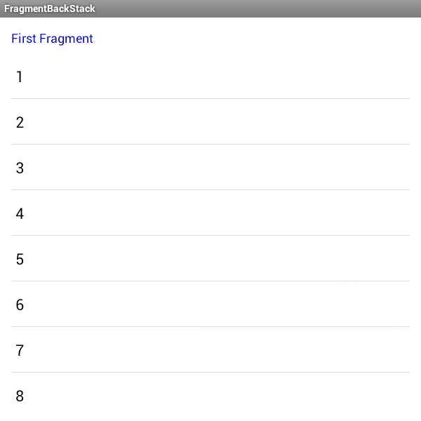
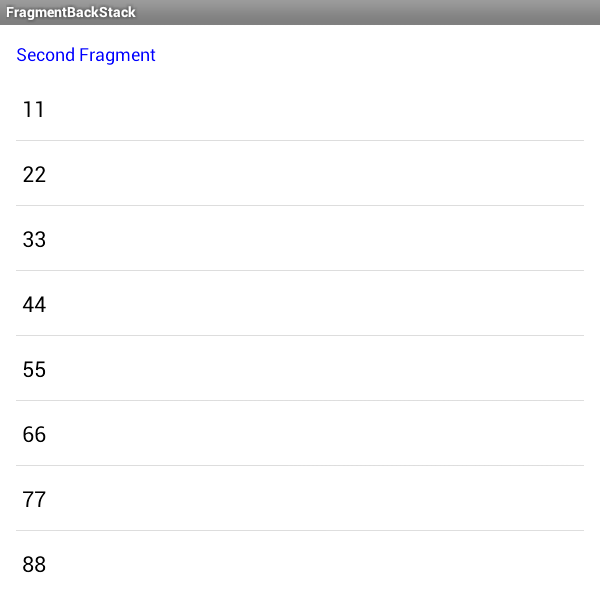

Fragment-Back-Stack
===================

Fragment Back Stack manager while displaying fragments on single activity and need to maintain on back press

Purpose
-------------

We know that there is activity stack in Android. We don't need to maintain the stack while opening or closing
activity. It will automatically handle the stack and show you the top of activity when you pressed `back` button.

But in fragment, its neccessary to handle them. Because Android is not going to handle them. We need to create
a stack of fragment and manage them while pressing `back` button.

So, I have created one demo to represent how to handle the fragment in Back Stack.

Usage
-------------

In the sample application, you will find one object named `fragmentStack`. Its a `Stack` which will
push and pop the fragment as per requirement.

Whenever you are displaying any new fragment, just push that fragment into stack using following code.

    //here this fragment is our first fragment
    homeListFragment = new HomeListFragment();
    fragmentStack.push(homeListFragment);
    

    
And when you are displaying any other fragment over this fragment, use following code.

We will create a new object of second fragment and add it to stack.

    //here this fragment is second fragment
    resultListFragment = new ResultListFragment();
    //hide the last fragment
    ft.hide(fragmentStack.lastElement());
    //push the new fragment into stack
    fragmentStack.push(resultListFragment);
		

	
When `backPressed` event fires, we will check whether stack size is `2` or not. If it is, then we will pop last 
fragment and display the previous fragment by following code.

    if (fragmentStack.size() == 2) {
        FragmentTransaction ft = fragmentManager.beginTransaction();
        fragmentStack.lastElement().onPause();
        ft.remove(fragmentStack.pop());
        fragmentStack.lastElement().onResume();
        ft.show(fragmentStack.lastElement());
        ft.commit();
    } else {
        //if size is `1` it means first fragment is visible and we can exit from application
        super.onBackPressed();
    }
    
MIT License
-------------

The MIT License (MIT)

Copyright (c) 2015 Chintan Rathod

Permission is hereby granted, free of charge, to any person obtaining a copy
of this software and associated documentation files (the "Software"), to deal
in the Software without restriction, including without limitation the rights
to use, copy, modify, merge, publish, distribute, sublicense, and/or sell
copies of the Software, and to permit persons to whom the Software is
furnished to do so, subject to the following conditions:

The above copyright notice and this permission notice shall be included in all
copies or substantial portions of the Software.

THE SOFTWARE IS PROVIDED "AS IS", WITHOUT WARRANTY OF ANY KIND, EXPRESS OR
IMPLIED, INCLUDING BUT NOT LIMITED TO THE WARRANTIES OF MERCHANTABILITY,
FITNESS FOR A PARTICULAR PURPOSE AND NONINFRINGEMENT. IN NO EVENT SHALL THE
AUTHORS OR COPYRIGHT HOLDERS BE LIABLE FOR ANY CLAIM, DAMAGES OR OTHER
LIABILITY, WHETHER IN AN ACTION OF CONTRACT, TORT OR OTHERWISE, ARISING FROM,
OUT OF OR IN CONNECTION WITH THE SOFTWARE OR THE USE OR OTHER DEALINGS IN THE
SOFTWARE.
